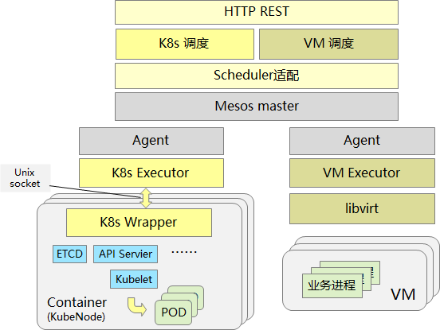
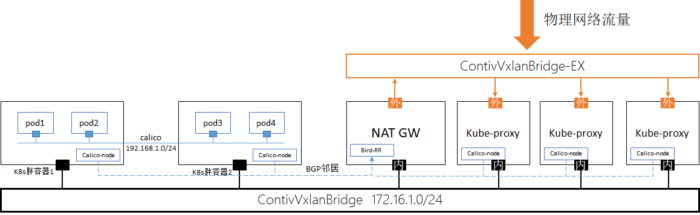
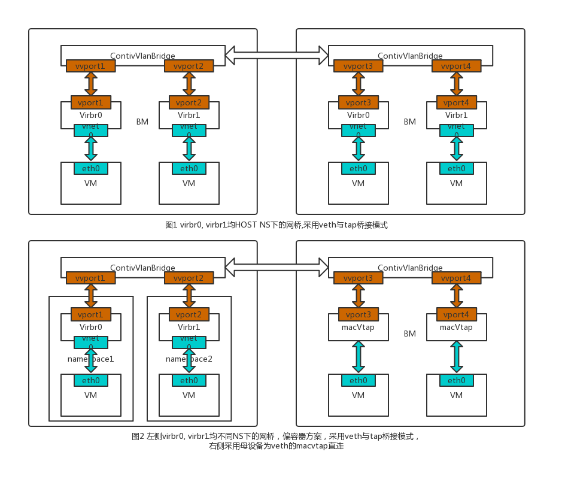

# CKE简介

&ensp;&ensp;&ensp;&ensp;CKE(Mesos Framework)是一个基于mesos调度的多kubernets集群(或VM)部署及运维平台
由于使用mesos进行底层资源调度其组成分成两部分**scheduler**和**executor**。同时为了兼容kubernetes和VM，对executor进行了抽象，并且有两个具体的实现：k8s_executor和vm_executor。

## 架构



### 1.CKE Kubernetes

网络模型



1. K8S胖容器作为宿主承载在Contiv网络之上，内置的租户业务Pods承载在Calico网络之上；
2. Calico作为路由转发方案(需区别于隧道方案)，其核心机制为【将容器内所有流量被引流到宿主胖容器，然后按照宿主的路由表进行路由转发】，故整个方案自始至终只有Contiv Vxlan一层叠加网络， K8S胖容器中的calico网络并不会带来额外的网络开销与性能损耗；
3. K8S胖容器中的Calico-Node与VR、Kube-Proxy中的Bird-RR建立BGP邻居关系，实现VR、Kube-Proxy与租户业务Pods之间的直接路由通信；
4. NAT GW以HA模式部署且封装在NS中，并通过Iptables SNAT/DNAT规则实现租户业务Pods出租户虚拟网、租户业务Pods在三层的服务暴露；
5. Kube-Proxy以独立模式部署且封装在NS中，并通过动态IPVS规则实现租户业务Pods在四层的服务暴露。

### 2.CKE VM(QEMU-KVM)

Mesos调度启动虚拟机流程

```text
+------------+
| Vmexecutor |
+------------+
      |---------------|
+------------+        |
|   Started  |        v
+------------+    +------------+
      |           |   Launch   |
+------------+    +------------+
|  VmContext |<+        |
+------------+ |  +------------+
               |  |   VmTask   |
               +--|   Domain   |
                  +------------+
```

网络模型



## 开发环境

### 依赖的环境

CKE需要的软件：

* golang 1.12\+
* protoc 3.6.1

## 编译

```bash
git clone git@10.124.142.69:welkin/cke.git
cd cke
make
```

## 部署

### 基础环境

* centos 7.2\+
* mesos 1.4\+
* docker 17\+
* 网络，如：docker overlay，contiv等
* 所需的docker images

### 安装

CKE作为DC/OS的Package无需进行安装。 只要启动一个CKE scheduler即可。

## 运行

&ensp;&ensp;&ensp;&ensp;CKE集群的功能是由三种进程的多个实例相互协作完成。三种进程为：***cke-scheduler***,***cke-k8s-exec***(或cke-vm-exec),***cke-wrapper***。其中只有cke-scheduler是用户直接负责启动的。其他进程是由cke-scheduler和mesos协作完成启停（生命周期）管理。
  
### 启动

cke-scheduler 可以通过命令行在裸机上启动，也可以通过docker容器或DC/OS Package的方式启动

#### 流程

整个CKE集群的启动流程如下：  
[待完善]

#### 命令参数

&ensp;&ensp;&ensp;&ensp;通过指定cke-scheduler的启动参数，可以控制cke集群的一些业务行为。

##### cke-scheduler参数

**通用部分:**
  
|参数|类型|缺省值|说明|
|------|------|------|------|
| -storage_type  | string | - | cke-scheduler的HA机制使用的存储服务类型,形如"etcd、zookeeper"等，默认“empty”,当没有配置时不使用HA功能|
| -storage_servers  | string | - | cke-scheduler的HA机制使用的存储服务地址,形如"http://1.2.3.4:2379,http://1.2.3.5:2379"等，配合“storage_type”使用,当没有配置时不使用HA功能|
| -listen | string | 0.0.0.0:8512 | cke-scheduler 对外提供web服务的侦听地址|
| -master | string | - | cke使用的mesos master的地址|
| -name | string | cke-framework | CKE在mesos中framework的名称 |
| -roles | string | * | CKE使用mesos哪几个role启动framework，role间用逗号分隔 |
| -service_host | string | $HOST | CKE对外暴露服务时实际的host。如果参数以$开始，CKE将认为该参数是一个环境变量(environment variables),将会读取该环境变量对应的值来作为host使用。该参数使用的场景通常是CKE工作在一个Bridge网络模式的容器中，用来对外暴露服务。|
| -service_port | string | $PORT | CKE对外暴露服务时实际的端口。如果参数以$开始，CKE将认为该参数是一个环境变量(environment variables),将会读取该环境变量对应的值来作为port使用。该参数使用的场景通常是CKE工作在一个Bridge网络模式的容器中，用来对外暴露服务。|
| -failover | int | 86000 | CKE scheduler离线时间。超过该时间后mesos master将停止对应framework上的task，并驱逐该的framework。 |
| -log_level | string | INFO | cke-scheduler输出的日志级别，可以选error,warning,info,debug |
| -framework_url | string | - | cke framework web url，用于cke注册框架时在mesos上的祖册信息。|
| -executor_url | string | 与framework service_host:service_port相同 | cke executor的下载服务器，如果没有设置则使用cke自身的路径: http://ip:port/exec/&lt;xxxxxx&gt; &lt;xxxxxx&gt; 为executor的名称由其他参数定义 |

**k8s部分：**

|参数|类型|缺省值|说明|
|------|------|------|------|
| -k8s_cfs | bool | false | CKE是否在KubeNode容器上使用cfs |
| -k8s_docker_path | string | - | 该路径为宿主机具有xfs文件系统的路径。该路径被挂载到KubeNode中，被其中的dockerd作为工作目录使用
| -k8s_executor | string | cke-k8s-exec | CKE k8s模块使用的executor的名称。该名称对应的可执行文件应该位于CKE scheduler所提供服务的如下URL下http&#58;&#47;&#47;server&#58;port/exec/。mesos各节点上的agent会通过这个URL来自动下载对应的executor。 |
| -k8s_lxcfs | string | - | 加载KubeNode时挂载的lxcfs的目录。如果未设置，将不使用lxcfs而用控制系统预留资源的方式限制kubelet的资源使用 |
| -k8s_image_path | string | reg.mg.hcbss/open | KubeNode镜像在 dokcer registry 中的目录位置，注意：该字符串不应该包含镜像的名称和版本(镜像名和版本在cke.conf-x.xx.yaml中描述) |
| -k8s_registry | string | reg.mg.hcbss:10.124.142.43 | kubernetes使用的dokcer registry地址,该地址分成域名和IP两部分。该配置会作为一个DNS记录配置到各容器节点所在的/etc/hosts中，同时该域名将以DOCKER_REGISTRY=<域名>的形式配置到各系统进程的环境变量中。 |
| -k8s_registry_cert | string | /cke-scheduler/reg.mg.hcbss.crt | kubernetes使用的dokcer registry 证书配置，支持本地文件和http协议 |
| -k8s_spider_lb_endpoint | string | - | kubernetes使用的spider网络的LB服务endpoint地址配置,形如"http&#58;&#47;&#47;10.124.142.49&#58;65334",10.124.142.49:65334是廊坊测试区LB地址。如果未设置,将强制使用桥接容器端口模式实现流量引入。|

**例如**  
启动scheduler:  

```bash
docker run --env "HOST=10.124.142.224" --env "PORT=8512" -p8512:8512 reg.mg.hcbss/open/cke-scheduler:v0.0.2 /cke-scheduler/cke-scheduler -name cke-test -roles cke -k8s_executor cke-k8s-exec -k8s_image_path 'reg.mg.hcbss/open' -k8s_lxcfs_path="/var/lib/lxc/lxcfs"  -k8s_registry_cert=./reg.mg.hcbss/reg.mg.hcbss.crt  -k8s_config_path=./default_cfg  -k8s_spider_lb_endpoint=http://10.124.142.49:65334
```

启动一个kubernetes集群(在内网环境下,使用桥接容器端口的模式实现流量引入)：  

```bash
curl -H "Content-Type:application/json" -X POST http://10.124.142.224:8512/k8s/clusters -d '{"cluster_name": "my","cluster_type": "k8s","network": "spidernet-vpc56173cke","kubenodes": [{"name": "master","type":"master","host": "10.124.142.224","node_ip": "192.168.0.80","process": [{"name": "etcd","type": "etcd","res":{"cpu": 0.1,"memory": 512},"cmd": "/usr/local/bin/etcd","options": []},{"name": "apiserver","type": "apiserver","res":{"cpu": 0.5,"memory": 4086},"cmd": "/usr/local/bin/kube-apiserver","options": []},{"name": "controller","type": "controller","res":{"cpu": 0.1,"memory": 1024},"cmd": "/usr/local/bin/kube-controller-manager","options": []},{"name": "scheduler","type": "scheduler","res":{"cpu": 0.1,"memory": 1024},"cmd": "/usr/local/bin/kube-scheduler","options": []},{"name": "docker","type": "masterdocker","res":{"cpu": 1,"memory": 512},"cmd": "/usr/bin/dockerd","options": []}]},{"name": "node0","type":"node","host": "10.124.142.224","node_ip": "192.168.0.81","ingresses": ["igr1"],"process": [{"name": "docker","type": "nodedocker","res":{"cpu": 1,"memory": 512},"cmd": "/usr/bin/dockerd","options": []},{"name": "kubelet","type": "kubelet","res":{"cpu": 4,"memory": 4096},"cmd": "/usr/local/bin/kubelet","options": []},{"name": "kube-proxy","type": "kubeproxy","res":{"cpu": 0.5,"memory": 1024},"cmd": "/usr/local/bin/kube-proxy","options": []}]}, {"name": "console","type":"console","host": "*","node_ip": "192.168.0.82", "gottyport":"", "process": [{"name": "gotty","type": "gotty","res":{"cpu": 0.2,"memory": 512},"cmd": "/usr/local/bin/gotty","options": []}]}],"ingresses": [{"name": "igr1","port": "34571/tcp"},{"name":"igr2","port":"34572/tcp"},{"name":"igr3","port":"34573/tcp"}]}'

curl -H "Content-Type:application/json" -X POST http://10.124.142.224:8512/k8s/clusters -d '{"cluster_name":"my","k8s_ver":"1.15","cluster_type": "k8s","network": "spidernet-vpc56173cke","kubenodes": [{"name": "master","type":"master","host": "10.124.142.224","node_ip": "192.168.0.80","process": [{"name": "etcd","type": "etcd","res":{"cpu": 0.1,"memory": 512},"cmd": "/usr/local/bin/etcd","options": []},{"name": "apiserver","type": "apiserver","res":{"cpu": 0.5,"memory": 4086},"cmd": "/usr/local/bin/kube-apiserver","options": []},{"name": "controller","type": "controller","res":{"cpu": 0.1,"memory": 1024},"cmd": "/usr/local/bin/kube-controller-manager","options": []},{"name": "scheduler","type": "scheduler","res":{"cpu": 0.1,"memory": 1024},"cmd": "/usr/local/bin/kube-scheduler","options": []},{"name": "docker","type": "masterdocker","res":{"cpu": 1,"memory": 512},"cmd": "/usr/bin/dockerd","options": []}]},{"name": "node0","type":"node","host": "10.124.142.224","node_ip": "192.168.0.81","ingresses": ["igr1"],"process": [{"name": "docker","type": "nodedocker","res":{"cpu": 1,"memory": 512},"cmd": "/usr/bin/dockerd","options": []},{"name": "kubelet","type": "kubelet","res":{"cpu": 4,"memory": 4096},"cmd": "/usr/local/bin/kubelet","options": []},{"name": "kube-proxy","type": "kubeproxy","res":{"cpu": 0.5,"memory": 1024},"cmd": "/usr/local/bin/kube-proxy","options": []}]}, {"name": "console","type":"console","host": "*","node_ip": "192.168.0.82", "gottyport":"", "process": [{"name": "gotty","type": "gotty","res":{"cpu": 0.2,"memory": 512},"cmd": "/usr/local/bin/gotty","options": []}]}],"ingresses": [{"name": "igr1","port": "34571/tcp"},{"name":"igr2","port":"34572/tcp"},{"name":"igr3","port":"34573/tcp"}]}'
```

启动一个kubernetes集群(使用spider LB模式实现流量引入)：  

```bash
curl -H "Content-Type:application/json" -X POST http://10.124.142.224:8512/k8s/clusters -d '{"cluster_name": "my","cluster_type": "k8s","network": "spidernet-vpc56173cke","kubenodes": [{"name": "master","type":"master","host": "10.124.142.224","node_ip": "192.168.0.80","process": [{"name": "etcd","type": "etcd","res":{"cpu": 0.1,"memory": 512},"cmd": "/usr/local/bin/etcd","options": []},{"name": "apiserver","type": "apiserver","res":{"cpu": 0.5,"memory": 4086},"cmd": "/usr/local/bin/kube-apiserver","options": []},{"name": "controller","type": "controller","res":{"cpu": 0.1,"memory": 1024},"cmd": "/usr/local/bin/kube-controller-manager","options": []},{"name": "scheduler","type": "scheduler","res":{"cpu": 0.1,"memory": 1024},"cmd": "/usr/local/bin/kube-scheduler","options": []},{"name": "docker","type": "masterdocker","res":{"cpu": 1,"memory": 512},"cmd": "/usr/bin/dockerd","options": []}]},{"name": "node0","type":"node","host": "10.124.142.224","node_ip": "192.168.0.81","ingresses": ["igr1"],"process": [{"name": "docker","type": "nodedocker","res":{"cpu": 1,"memory": 512},"cmd": "/usr/bin/dockerd","options": []},{"name": "kubelet","type": "kubelet","res":{"cpu": 4,"memory": 4096},"cmd": "/usr/local/bin/kubelet","options": []},{"name": "kube-proxy","type": "kubeproxy","res":{"cpu": 0.5,"memory": 1024},"cmd": "/usr/local/bin/kube-proxy","options": []}]}, {"name": "console","type":"console","host": "*","node_ip": "192.168.0.82", "gottyport":"", "process": [{"name": "gotty","type": "gotty","res":{"cpu": 0.2,"memory": 512},"cmd": "/usr/local/bin/gotty","options": []}]}],"ingresses": [{"name": "igr1"},{"name":"igr2"},{"name":"igr3"}]}'

curl -H "Content-Type:application/json" -X POST http://10.124.142.224:8512/k8s/clusters -d '{"cluster_name":"my","k8s_ver":"1.14","cluster_type": "k8s","network": "spidernet-vpc56173cke","kubenodes": [{"name": "master","type":"master","host": "10.124.142.224","node_ip": "192.168.0.80","process": [{"name": "etcd","type": "etcd","res":{"cpu": 0.1,"memory": 512},"cmd": "/usr/local/bin/etcd","options": []},{"name": "apiserver","type": "apiserver","res":{"cpu": 0.5,"memory": 4086},"cmd": "/usr/local/bin/kube-apiserver","options": []},{"name": "controller","type": "controller","res":{"cpu": 0.1,"memory": 1024},"cmd": "/usr/local/bin/kube-controller-manager","options": []},{"name": "scheduler","type": "scheduler","res":{"cpu": 0.1,"memory": 1024},"cmd": "/usr/local/bin/kube-scheduler","options": []},{"name": "docker","type": "masterdocker","res":{"cpu": 1,"memory": 512},"cmd": "/usr/bin/dockerd","options": []}]},{"name": "node0","type":"node","host": "10.124.142.224","node_ip": "192.168.0.81","ingresses": ["igr1"],"process": [{"name": "docker","type": "nodedocker","res":{"cpu": 1,"memory": 512},"cmd": "/usr/bin/dockerd","options": []},{"name": "kubelet","type": "kubelet","res":{"cpu": 4,"memory": 4096},"cmd": "/usr/local/bin/kubelet","options": []},{"name": "kube-proxy","type": "kubeproxy","res":{"cpu": 0.5,"memory": 1024},"cmd": "/usr/local/bin/kube-proxy","options": []}]}, {"name": "console","type":"console","host": "*","node_ip": "192.168.0.82", "gottyport":"", "process": [{"name": "gotty","type": "gotty","res":{"cpu": 0.2,"memory": 512},"cmd": "/usr/local/bin/gotty","options": []}]}],"ingresses": [{"name": "igr1"},{"name":"igr2"},{"name":"igr3"}]}'
```

##### cke-k8s-exec参数

[待完善]

### kubernetes 多版本支持

1）对于scheduler的命令行参数：
 配置-k8s_node_image参数。该参数描述 KubeNode镜像在 dokcer registry 中的目录位置，注意：该字符串不应该包含镜像的名称和版本(镜像名和版本在cke.conf-x.xx.yaml中描述)形如:reg.mg.hcbss/open。最终的镜像名由-k8s_image_path加上cke.conf.yaml中的ImageName组合而成(reg.mg.hcbss/open/cke-k8s-wrapper:v0.2.3)。  
2）在cke scheduler的集群创建json中用字段"k8s_ver":"1.14"描述希望使用的kubernetes的版本。cke scheduler会通过该版本信息选择不同的cke.conf.yaml配置文件(如cke.conf-1.14.yaml),以达到启动不同k8s的目的。  

## 监控

[待完善]

## API

CKE对外提供RESTFul风格的API供客户UI或第三方使用。API列表如下：  

|方法|API|说明|
|------|------|------|
| GET | /ver  | 获得CKE的版本号 |
| GET | /stack  | 打印CKE scheduler的调用栈  |
| GET | /log | 获得CKE日志级别  |
| POST | /log | 设置CKE日志级别，级别可以是error,warning,info,debug。例子：curl -X POST http://ip:port/log -d '{"level":"info"}'  |
| GET | /exec/&lt;cke-executor-name&gt;  | 下载CKE executor  |
| GET | /k8s/v1/help CKE kubernetes | 部分的API帮助  |
| GET | /k8s/v1/supported_ver | 返回当前支持的kubernetes版本  |
| GET | /k8s/v1/clusters | 获得当前集群列表  |
| POST | /k8s/v1/clusters | 创建一个集群  |
| GET | /k8s/v1/clusters/&lt;name&gt; | 获得指定集群的信息  |
| GET | /k8s/v1/clusrers/&lt;name&gt;/state | 获得指定集群的进一步详细信息  |
| DELETE | /k8s/v1/clusters/&lt;name&gt; | 删除指定集群  |
| GET | /k8s/v1/clusters/&lt;name&gt;/adminToken | 获得指定k8s集群的管理员Token  |
| POST | /k8s/v1/clusters/&lt;name&gt;/nodes | 向指定集群添加节点  |
| GET | /k8s/v1/clusters/&lt;name&gt;/nodes/ | 获得指定集群某节点的信息  |
| DELETE | /k8s/v1/clusters/&lt;name&gt;/nodes/&lt;node&lt; | 删除指定集群  |
| PUT | /k8s/v1/clusters/&lt;name&gt;/nodes/&lt;node&gt;/processes/&lt;process&gt; | 更新(重启)集群中的某节点的指定进程  |
| GET | /k8s/v1/clusters/&lt;name&gt;/logs | 获得基于web socket流的集群日志  |
| GET | /k8s/v1/clusters/&lt;name&gt;/nodes/&lt;node&gt;/processes/&lt;proc&gt;/files/&lt;file&gt; | 获得指定进程的日志输出文件  |
| GET | /k8s/v1/clusters/&lt;name&gt;/console/kubectl | 获取kubectl控制台Web终端  |
| GET | /k8s/v1/clusters/&lt;name&gt;/console/dashboard | 获取kubernetes集群的 dashboard  |
| GET | /k8s/v1/clusters/&lt;name&gt;/json | 获取创建kubernetes集群的 json  |

## TODO

1.资源修改和进程启停的任务分开处理  
2.Executor启动Container的错误上报  
3.CKE发生错误时的整体方案  
4.Pod模式的支持  
5.API Server的服务对外暴露  
6.etcd 备份  
