# cke  简介

​ CKE(Chinaunicom Kubernetes Engine)是一个基于mesos调度的多Kubernetes集群(或VM)部署及运维平台，为容器化的应用提供高效部署、资源调度、服务发现和动态伸缩等一系列完整功能，解决用户开发、测试及运维过程的环境一致性问题，提高了大规模容器集群管理的便捷性，帮助用户降低成本，提高效率。

- 组件名: cke

- 版本：0.3.0

- 规模：集群版

- 描述：快速自定义部署多主节点，动态调整计算节点资源及数量，拥有VPC网络和分布式存储的Kubernetes集群管理平台

------

## 组件安装流程

### 自定义配置文件准备工作

如果要使用`集群管理器HA`功能，保障集群管理的健壮性，需要首先安装`ETCD`。

具体操作步骤详见 [自定义配置文件](http://10.172.49.2/components/public_gitbook/使用/安装组件.html)

### 组件查询

天宫界面点击组件仓库，在查询框中输入组件名，在组件列表中找到需要安装的组件。  

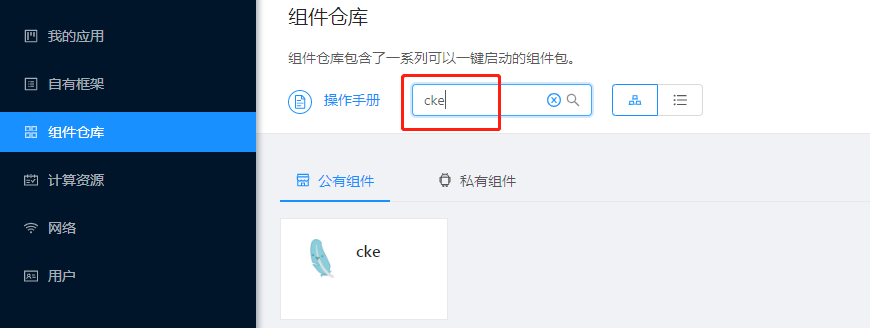

### 安装组件

选择合适的版本，并点击`操作`->`安装组件`进行组件安装。

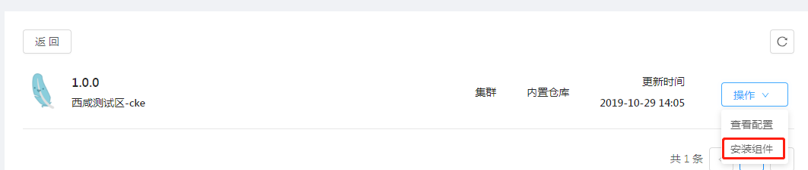

```java

```

### 填写组件配置

针对各配置项，若有疑问，可点击配置项右方问号处 ，获取详细填写说明。

- 公共配置项 填写CKE服务名称，实例个数，CPU数量，内存大小

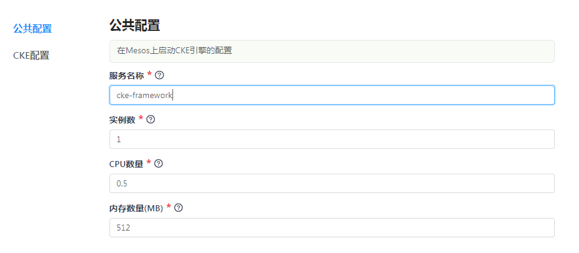

- CKE配置项 填写CKE框架名称，Role名称， 和Spider网络的URL

  其中：

  - Role名称是指当前租户的名称

    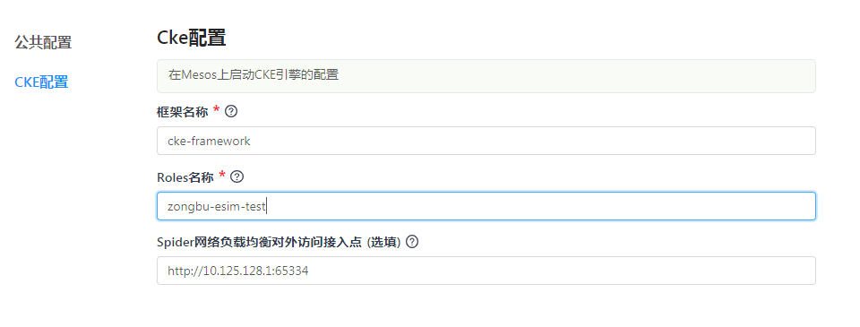
  
### 创建cke集群

  在天宫界面上点击“自有框架”，输入安装组件时填写的name项名称，搜索到正在运行的服务，点击“进入控制台”。

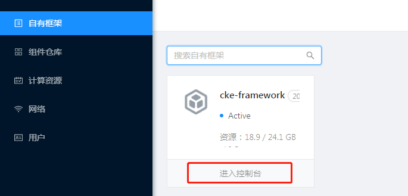

点击先建集群，开始创建新的集群

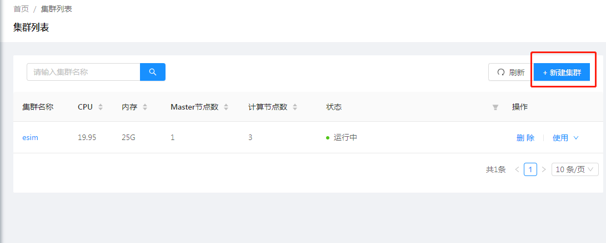

第一步：填写集群的通用配置，包括集群名(必填)，网络名称(必填)和console的配置，可以在创建的时候不指定console(不建议)，默认创建console控制台

- 集群名支持字母和数字的组合

- 网络名称：需要填写支持cke的VPC网络名称

- consoleIp填写VPC子网段的IP地址， console port填写console暴露的端口，范围在1024-65535  

- ingress支持两种模式，默认LB模式；如果以Bridge的模式创建，需要手动输入暴露的端口,并且在`Node配置`的选择ingress处选择端口

  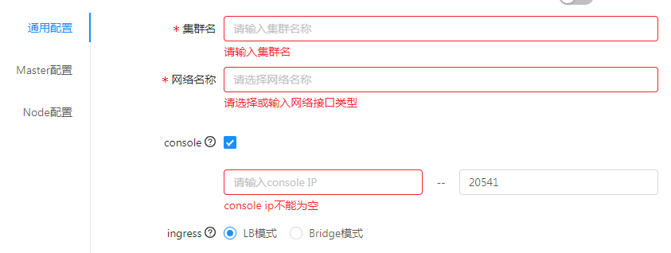

第二步：填写集群的Master配置，点击`Master配置`选项卡

- Master节点数量：指定集群主节点的数量，支持1,3,5个主节点。
  - master IP: 必填项，填写VPC子网段的IP地址
  - master host: 必填项，默认是*
  - 是否事先预留项：支持节点资源的预留
- k8s系统服务配置：用来指定master节点进程使用的资源，启动的参数，环境变量
  - 资源：包含进程所使用的CPU和内存
  - 参数：master节点各进程的启动参数。各进程已有默认值，通常无需额外指定
  - 环境变量：master节点各进程的环境变量。各进程已有默认环境变量，通常无需额外指定

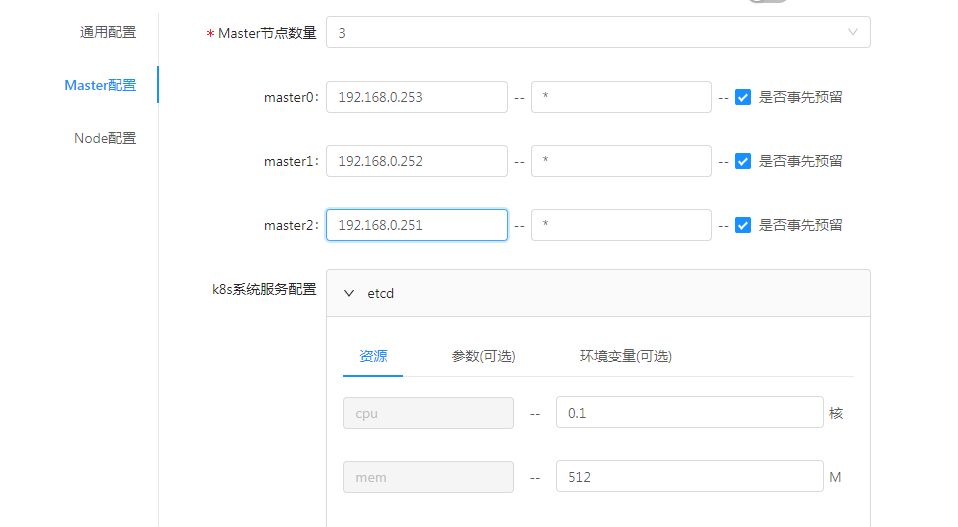

第三步：填写集群的Node配置，点击`Node配置`选项卡

- Node节点数量：指定集群主节点的数量，目前最多支持50个。
  - node IP: 必填项，填写VPC子网段的IP地址
  - node host: 必填项，默认是*
  - 是否事先预留项：支持节点资源的预留
  - 选择ingress: 如果在`通用配置` 选择bridge模式, 需要在此选择填写的bridge端口
- k8s系统服务配置：用来指定master节点进程使用的资源，启动的参数，环境变量
  - 资源：包含进程所使用的CPU和内存
  - 参数：node节点各进程的启动参数。各进程已有默认值，通常无需额外指定
  - 环境变量：node节点各进程的环境变量。各进程已有默认环境变量，通常无需额外指定

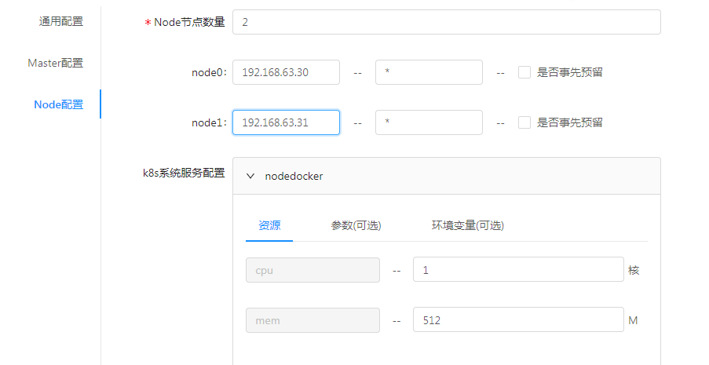

### cke集群列表

查看集群列表  


可对集群列表进行 `模糊检索` 和 `刷新` 操作。以及对集群实例进行 `删除` 操作  
点击 `Kubectl` 进入命令行页面，如下图所示：  
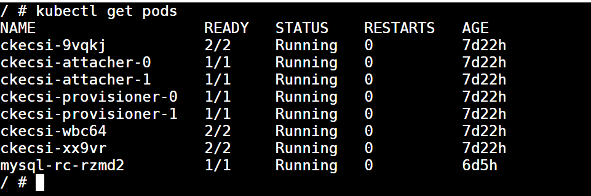

点击 `Dashboard` 进入控制台页面，如下图所示：  
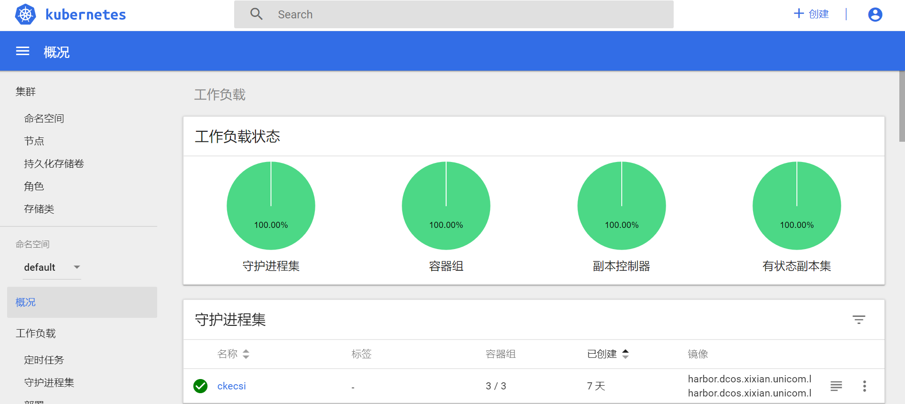

点击 集群名称 如 ==esim== 进入集群详情页。

#### cke集群详情页

进入集群详情页后如下图所示：

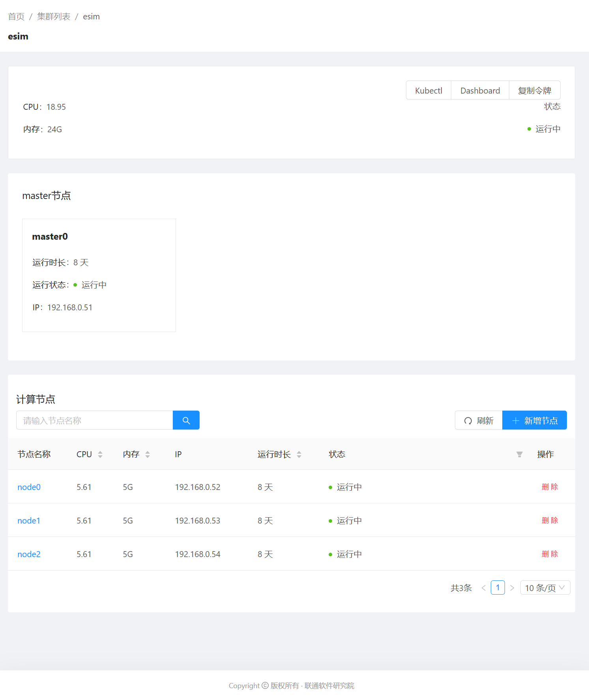

详情页里面的 `Kubectl` 及 `Dashboard` 按钮与集群列表页的 `Kubectl` 及 `Dashboard` 的功能一样。

`复制令牌` 功能在 `Dashboard` 令牌登录的时候 `粘贴` 即可进行登录。

 计算节点列表可进行 `模糊检索` 和 `刷新` 操作。

 对单个计算节点可进行 `删除` 操作，点击计算节点名称或者master节点的模块即可进入节点详情页。

##### 节点详情页

进入节点详情页后如下图所示：

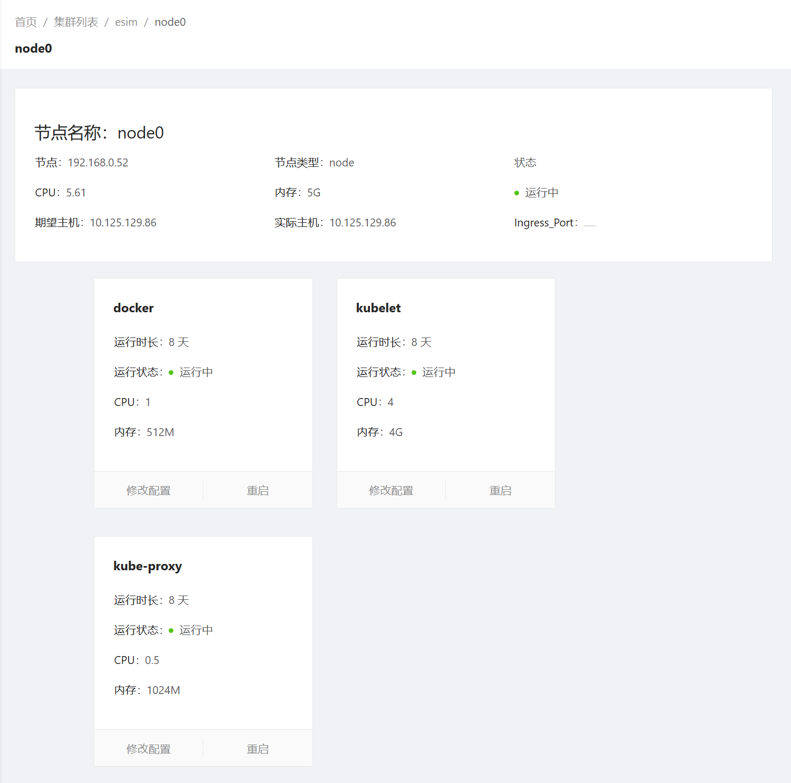

点击 `修改配置` 即弹出修改配置弹框，如下图所示：

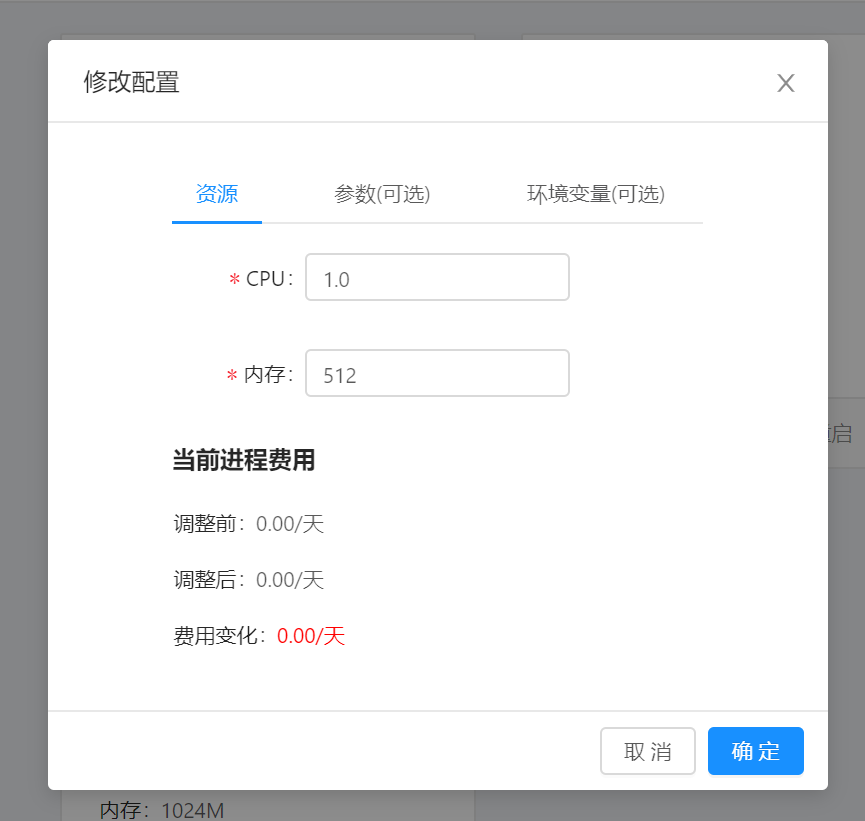

点击 `重启` 即可对进程进行重启操作。

------

## 组件服务日常运维操作

具体操作步骤详见 [维护组件](http://10.172.49.2/components/public_gitbook/使用/维护组件.html)
