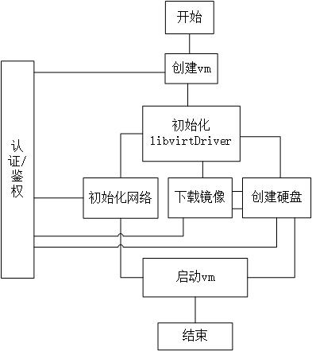

# VM 各组件交互逻辑

## 组件
1. 存储
2. 网络
3. 镜像

### 1. 创建`实例`过程


### 2. 删除`实例`过程


### 3. `cloud-init`初始化
```shell script
cat >> user-data <<EOF
#cloud-config
password: passw0rd
chpasswd: { expire: False }
EOF

cloud-localds my-seed.img user-data
```
采用[NoCloud](https://cloudinit.readthedocs.io/en/latest/topics/datasources/nocloud.html)
进行操作系统初始化，允许用户自定义主机启动脚本等
```yaml
# instance id (meta data) 
instance-id: iid-abcdefg
# network ip addr
network-interfaces: |
  iface eth0 inet static
  address 192.168.1.10
  network 192.168.1.0
  netmask 255.255.255.0
  broadcast 192.168.1.255
  gateway 192.168.1.254
# 主机名称 
hostname: myhost
# 用户及口令
password: passw0rd
chpasswd: { expire: False }
# 其他用户自定义初始化脚本 (user data)
 
```
挂载磁盘
```xml
<disk type='file' device='cdrom'>
      <driver name='qemu' type='raw'/>
      <source file='/data/my-seed.img'/>
      <target dev='vdb' bus='virtio'/>
</disk>
``` 
### 4. libvirt使用ovs网络
```shell script
ovs-vsctl show 
ovs-vsctl add-br ovsbrvm
ovs-vsctl show
```
```xml
<interface type='bridge'>
  <mac address='52:54:00:71:b1:b3'/>
  <source bridge='ovsbrvm'/>
  <virtualport type='openvswitch'/>
</interface>
```

使用`virsh domiflist []`可查看相应的虚拟机 网卡情况

```shell script
# 查看流表
ovs-ofctl dump-flows ovsbrvm
ovs-ofctl add-flow ovsbrvm in_port=2,dl_src=fe:54:00:71:b1:b6,actions=output:3
ovs-ofctl del-flows ovsbrvm "in_port=2"
```


### 5. libvirt使用contiv网络 
```shell script
echo "1" > /proc/sys/net/ipv4/ip_forward
echo "1" > /proc/sys/net/ipv4/conf/all/accept_local
echo "1" > /proc/sys/net/ipv4/conf/default/accept_local
echo "1" > /proc/sys/net/ipv4/conf/vport256/accept_local
echo "1" > /proc/sys/net/ipv4/conf/vnet4/accept_local
```
`contiv`和`tap`设备通`过macvtap passthrough`直连
```shell script
<interface type='direct'>
  <mac address='02:02:c0:a8:00:01'/>
  <source dev='vport256' mode='passthrough'/>
  <model type='virtio'/>
  <driver name='vhost'/>
  <address type='pci' domain='0x0000' bus='0x00' slot='0x03' function='0x0'/>
</interface>
```


### 6. 参考
http://docs.openvswitch.org/en/latest/howto/libvirt/